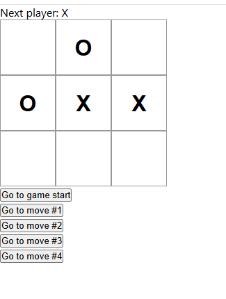

# Tic Tac Toe – React

A classic Tic Tac Toe game built with React by following the official React documentation (react.dev).

## 🧠 What I Practiced
- React component structure
- useState hook
- Handling user events
- Basic state management
- Conditional rendering

## ⚛️ Tech Stack
- React
- JavaScript (ES6)
- CSS

## ▶️ Run Locally
```bash
npm install
npm run dev
## 📸 Screenshot

